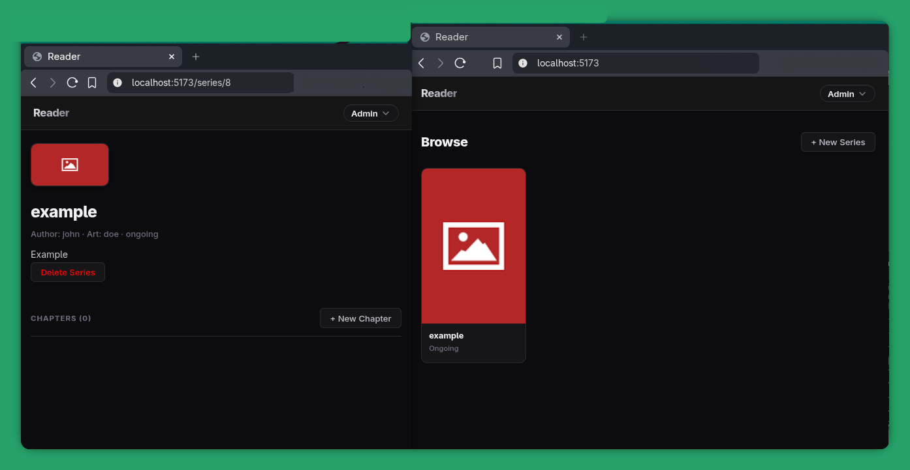

# Reader

A web application for reading manga and comics, featuring a Go backend and a React frontend.

## Project Structure

- `cmd/server/`: Backend entry point.
- `internal/`: Core backend logic (handlers, services, repositories, and models).
- `frontend/`: React application built with Vite and TypeScript.
- `docs/`: API and project documentation.
- `openapi.yml`: OpenAPI 3.0.3 specification for the REST API.

## Tech Stack

### Backend
- **Language**: Go (1.25+)
- **Router**: chi
- **ORM**: GORM
- **Database**: PostgreSQL
- **Storage**: S3-compatible object storage
- **Authentication**: JWT

### Frontend
- **Framework**: React 19
- **Build Tool**: Vite
- **Language**: TypeScript
- **Routing**: React Router

## Getting Started

### Prerequisites
- Docker and Docker Compose
- Go (for local development)
- Node.js and Bun (for local frontend development)

### Configuration
1. Copy the example environment file:
   ```bash
   cp .env.example .env
   ```
2. Update the `.env` file with your specific configuration, including database credentials and S3 settings.

### Running with Docker
Start the entire stack using Docker Compose:
```bash
docker-compose up --build
```
The backend will be available at `http://localhost:8080` and the frontend at `http://localhost:5173`.

### Local Development

#### Backend
```bash
go run cmd/server/main.go
```

#### Frontend
```bash
cd frontend
bun install
bun dev
```

## API Documentation
The API is documented using OpenAPI. You can view the full specification in `openapi.yml` or read the summary in `docs/api.md`.

System probes are available at `GET /api/v1/health` and the root alias `GET /health`. Public runtime config is available at `GET /api/v1/config` and intentionally excludes secrets.

## Features
- User registration and authentication.
- Role-based access control (Reader, Uploader, Moderator, Admin).
- Series and chapter management.
- S3-compatible image storage and retrieval.
- Administrative tools for system configuration and S3 maintenance.

## License
This project is licensed under the MIT License - see the `LICENSE` file for details.
